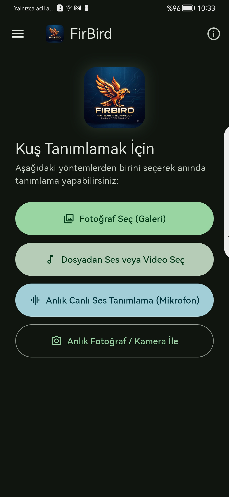
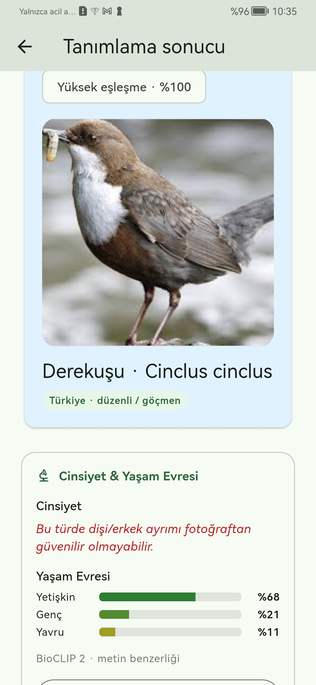
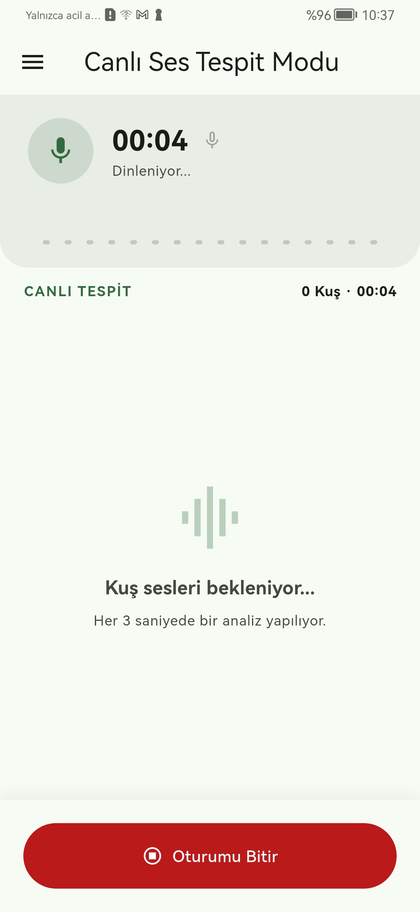
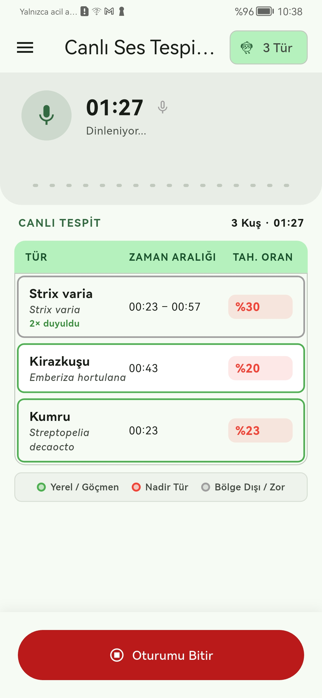

# FirBird 3 (v0.4.0)

FirBird 3, kuş fotoğraflarını ve ses kayıtlarını **tamamen cihaz üzerinde (çevrimdışı)** tanımlamaya odaklanan açık kaynaklı bir Android uygulamasıdır. Fotoğraf, ses ve konum bilgileri tanımlama için hiçbir sunucuya gönderilmez. Çevrimiçi harita yalnızca kullanıcı o oturum için açmayı seçerse OpenStreetMap görüntülerini yükler.

> Proje aktif geliştirme aşamasındadır (Güncel Sürüm: **v0.4.0**). Sonuçlar bir öneridir; özellikle nadir türlerde saha rehberleri ve güvenilir kaynaklarla doğrulanmalıdır.

---

## 🚀 Öne Çıkan Özellikler ve Yetenekler

- 📸 **Görsel Kuş Tanımlama**: Galeriden veya kameradan yüklenen fotoğraflarla BioCLIP-2 yapay zeka modeli kullanılarak yüksek doğrulukla tür tahmini.
- 🎙️ **Canlı Ses Tespit Modu**: Dahili BirdNET ONNX modeliyle her 3 saniyede bir ortam sesini analiz eder; sonuçları mobil uyumlu tespit kartları olarak gösterir.
- 🎨 **Tür Durumuna Göre Renkli Çerçeveler**:
  - 🟢 **Yeşil Çerçeve**: Yerel ve Göçmen Kuşlar (Türkiye yerleşik ve düzenli göçmen türleri)
  - 🔴 **Kırmızı Çerçeve**: Nadir Kuşlar (Türkiye'de nadir kaydı bulunan türler)
  - ⚪ **Gri Çerçeve**: Bölge Dışı / Olması Zor Kuşlar (Dünya türleri veya liste dışı kayıtlar)
- 📍 **Konum Bağlamı ve İzni**: GPS çevrimdışı kullanılabilir; çevrimiçi harita yalnızca kullanıcı o oturum için izin verirse açılır.
- 📜 **Akıllı Tanımlama Geçmişi**: Canlı ses oturumlarını tek bir özet kart olarak gruplama, modal detay tablosu ve WAV ses kaydına erişim.
- ☰ **Merkezi Navigasyon (AppDrawer)**: Ana Sayfa, Canlı Ses Tespiti, Son Tanımlamalar, Bölge Paketleri, Yakınımdaki Kuşlar ve Ayarlar sayfalarına her ekrandan erişim.
- 🎵 **Dahili Ses Oynatıcı**: Telefondan seçilen bir ses dosyasını FirBird 3 içinde döngüde oynatır; uygulama arka plana geçtiğinde otomatik durur.
- 💯 **Çevrimdışı Tanımlama**: 503 kuş türü, Türkçe ve bilimsel isimler, görsel ve işitsel yapay zeka modelleri APK paketine dahildir. Tanımlama için internet gerekmez.

---

## 📱 Uygulama Ekran Görüntüleri

> Ekran görüntüleri v0.3.x arayüzünü göstermektedir. v0.4.0; yenilenmiş ana ekran, kompakt eylem kartları, sonuç kartları ve canlı ses tespit kartlarını içerir.

|||||
|:---:|:---:|:---:|:---:|
| **Ana Sayfa** | **Canlı Ses Tespiti** | **Tanımlama Sonucu** | **Ayarlar & Tema** |

---

## 📊 Kapsam ve Kuş Sayıları

- **Toplam Desteklenen Kuş Türü**: **503 Tür** (Türkiye kuş faunası)
  - **Düzenli ve Göçmen Türler**: **421 Tür**
  - **Nadir Kayıtlar (Accidental)**: **82 Tür**
- **Ses Tanıma Destekli Türler**: BirdNET ONNX kütüphanesi kapsamında 6000+ dünya kuş sesi arasından Türkiye ve dünya kuşlarını anlık ayırt edebilme.

Her tanımlama sonucunda türün bölgesel kökeni açıkça gösterilir:
- `Türkiye · yerleşik`
- `Türkiye · düzenli / göçmen`
- `Türkiye · nadir kayıt`
- `Dünya Türü`

---

## 🛡️ Gizlilik

FirBird, tanımlama için fotoğrafları, ses kayıtlarını, EXIF verilerini veya konumu hiçbir sunucuya yüklemez. Geçmiş kayıtlar ve ses dosyaları yalnızca cihazınızın yerel hafızasında saklanır.

OpenStreetMap harita görüntüleri, yalnızca kullanıcı "Bu oturumda haritayı aç" seçeneğini onayladığında yüklenir. Harita kullanımı fotoğraf, ses veya tanımlama sonucunu üçüncü taraflara göndermez.

---

## 🛠️ Geliştirme ve Derleme

Flutter SDK ve Android SDK kurulduktan sonra:

```powershell
flutter pub get
flutter analyze
flutter test
flutter build apk --release --target-platform android-arm64 --split-per-abi
```

Bağlı Android cihazda çalıştırmak ve kurmak için:

```powershell
flutter run
```

VOG-L29 gibi ARM64 cihazlar için çıktı: `build/app/outputs/flutter-apk/app-arm64-v8a-release.apk`.

---

## 📜 Lisans

FirBird kaynak kodu [Apache License 2.0](LICENSE) ile lisanslanmıştır. Ticari kullanım, değiştirme, yeniden dağıtım ve satış lisans koşullarına tabi olarak serbesttir.
